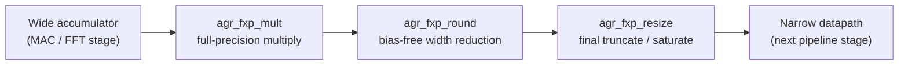

# AGR-FPGA-IP-Library

*Vendor-neutral SystemVerilog IP cores for FPGA-based embedded and edge systems — built by [Agrionics Co.](https://sincerelystepper.github.io/agrionicsco)*


This library is a single home for the reusable FPGA building blocks Agrionics
needs across its embedded/edge projects, instead of re-deriving the same
register bridge, fixed-point math, or CDC logic for every new design. Cores
are added when a real project needs them, verified before they're called
done, and documented with what they *can't* do yet, not just what they can.

---

## Contents

- [What's actually in here right now](#whats-actually-in-here-right-now)
- [Repository map](#repository-map)
- [Cores available now](#cores-available-now)
- [The fixed-point toolkit](#the-fixed-point-toolkit)
- [Design principles](#design-principles)
- [Verification approach](#verification-approach)
- [Quick start](#quick-start)
- [Roadmap](#roadmap)
- [Contributing](#contributing)
- [License](#license)

---

## What's actually in here right now

This repository is mid-build. The directory layout under `rtl/` is laid out
for the full scope of the library (communication, control, DSP,
infrastructure, math, memory, sensors), but most of those folders are
currently empty scaffolding (`.gitkeep` placeholders marking where a core
will land). **Two areas have real, working RTL today:**

- **`rtl/communication/spi/agr_spi_bridge`** — a complete SPI-to-register-bus
  bridge: RTL, architecture/timing/verification docs, waveform captures, a
  Yosys synthesis run against iCE40, and an honestly-documented limitations
  list.
- **`rtl/math/fixed_point/`** — four signed fixed-point primitives
  (`addsub`, `mult`, `resize`, `round`) intended to compose into DSP
  pipelines (MAC, FIR, FFT).

Everything else below describes exactly that — what's real, what's verified,
and what's still a folder waiting for code.

## Repository map

```
rtl/
├── communication/
│   ├── spi/agr_spi_bridge/    implemented + verified
│   └── can/ ethernet/ i2c/ uart/             planned
├── control/                  planned: pid · pwm · encoder · sigma_delta
├── dsp/                      planned: cic · cordic · fft · fir · nco · filters
├── infrastructure/           planned: cdc · clocking · pipeline · reset · synchronizers
├── math/
│   ├── fixed_point/           addsub · mult · resize · round
│   ├── divider/ multiplier/ sqrt/            planned
├── memory/                   planned: bram · fifo · rom · sram
└── sensors/                  planned: capture · pulse_counter · quadrature · timestamp

docs/        library-wide architecture, coding guidelines, supported devices,
             synthesis flow, verification strategy — currently stubs, see Roadmap
scripts/     ci · lint · simulation · synthesis — folders exist, scripts don't yet
```

## Cores available now

| Core | Path | Status | What it does |
|---|---|---|---|
| `agr_spi_bridge` | [`rtl/communication/spi/agr_spi_bridge`](rtl/communication/spi/agr_spi_bridge) |  Verified — directed WRITE/READ regression passes; synthesizes clean on iCE40 (146 cells, ~50 MHz est. Fmax) | SPI slave → internal register bus bridge, with CDC synchronization on every SPI input |
| `agr_fxp_mult` | [`rtl/math/fixed_point/mult`](rtl/math/fixed_point/mult) |  Verified — 20,038 self-checked vectors, 0 errors, `-Wall` clean | Signed fixed-point multiplier: full-precision product + configurable MSB/LSB-aligned truncation |
| `agr_fxp_resize` | [`rtl/math/fixed_point/resize`](rtl/math/fixed_point/resize) |  Verified — 24,053 self-checked vectors, 0 errors, `-Wall` clean | Signed width adapter: truncate or saturate, MSB- or LSB-aligned |
| `agr_fxp_round` | [`rtl/math/fixed_point/round`](rtl/math/fixed_point/round) |  Functional — known gap in rounding-overflow detection at the MSB-aligned upper boundary | Rounding-based width reduction: nearest / half-up / convergent (round-to-even) |
| `agr_fxp_addsub` | [`rtl/math/fixed_point/addsub`](rtl/math/fixed_point/addsub) |  Functional — overflow flag not yet validated for `OUT_W < IN_W` (narrowing) configurations | Signed add/subtract with optional saturation |

Status reflects what's been independently exercised against the RTL, not
just what each core's own notes claim — see
[Verification approach](#verification-approach).

## The fixed-point toolkit

`mult`, `round`, and `resize` are designed to compose directly in a DSP
datapath, each handing a clean, well-defined `overflow`/`precision_loss`
pair to the next stage:



`addsub` slots in anywhere signed accumulation is needed alongside this
chain. Every core in the toolkit follows the same two-flag contract
(`overflow` = true range error, `precision_loss` = information discarded but
still in range) so a consumer never has to guess which one matters for a
given decision.

## Design principles

These aren't aspirational — they're what's actually enforced in the cores
above, and what every new core is held to:

- **`overflow` and `precision_loss` are never conflated.** Every numeric
  core exposes both as independently-defined signals — a true magnitude/range
  error vs. information that was discarded but left the result still
  correctly ordered and in range.
- **No silent wraparound on a saturating path.** If a core offers
  saturation, hitting it always clamps to a real MIN/MAX value — it never
  falls back to a wrapped, sign-flipped bit pattern with the overflow flag
  left low.
- **Self-checking testbenches with a golden model, not waveform eyeballing.**
  The fixed-point cores compare every vector — directed and randomized —
  against an independently-computed 64-bit reference model at simulation
  time and report PASS/FAIL, not "looks right in GTKWave."
- **No implicit casting, no width-mismatch warnings.** RTL is written to
  lint clean under Verilator `-Wall`; every sign extension and truncation is
  explicit.
- **Limitations are documented, not hidden.** See `agr_spi_bridge`'s
  [Known Limitations](rtl/communication/spi/agr_spi_bridge/README.md#known-limitations)
  for the model every core's docs should follow: specific, independently
  reproducible findings, not hedging.

## Verification approach

Two harness styles currently coexist in this repo (consolidating on one is
on the [Roadmap](#roadmap)):

- **Fixed-point math cores** (`mult`, `resize`, `round`, `addsub`): a pure
  SystemVerilog testbench, run under [Verilator](https://www.veripool.org/verilator/),
  with a bit-accurate golden model computed in 64-bit testbench arithmetic.
  Every directed and randomized vector is checked against that model in the
  same simulation; the run ends with an explicit `*** TEST PASSED ***` /
  `*** TEST FAILED ***` and a checked-vector count, not a waveform to
  eyeball.
- **`agr_spi_bridge`**: a Verilator + C++17 harness (`tb/tb.cpp`) driving
  directed WRITE/READ transactions and asserting on the observed bus/SPI
  activity, plus an independent Yosys synthesis pass for gate-level sanity.

No formal verification or UVM anywhere yet — these are strong directed +
constrained-random regressions, not proofs.

## Quick start

Each fixed-point core follows the same one-shot Verilator flow:

```bash
cd rtl/math/fixed_point/resize    # or mult / round / addsub
verilator --binary --timing -Wall -sv \
    rtl/agr_fxp_resize.sv tb/tb_agr_fxp_resize.sv \
    --top-module tb_agr_fxp_resize -o tb_sim --Mdir obj_dir
./obj_dir/tb_sim
```

`agr_spi_bridge` uses a Makefile instead:

```bash
cd rtl/communication/spi/agr_spi_bridge/tb
make sim     # fast pass/fail regression
make wave    # regenerate waveforms/wave.vcd
```

## Roadmap

**Tooling (highest priority — nothing below scales without this)**
- [ ] CI pipeline: lint + simulation on every push (`scripts/ci/` exists, is empty)
- [ ] One consolidated verification harness style across all cores
- [ ] Fill in `docs/` (architecture, coding guidelines, supported devices, synthesis flow, verification strategy — currently heading-only stubs)

**Fixed-point math**
- [ ] Close the `agr_fxp_round` rounding-overflow gap at the MSB-aligned boundary
- [ ] Extend `agr_fxp_addsub` overflow detection to `OUT_W < IN_W` configurations
- [ ] Pipelined (registered) variants of `mult` / `resize` / `round`

**DSP** — CIC · CORDIC · FFT · FIR · NCO · general filters

**Control** — PID · PWM · quadrature encoder interface · sigma-delta

**Communication** — CAN · Ethernet · I2C · UART (full `agr_spi_bridge` parameterization is also still open — see its own [Known Limitations](rtl/communication/spi/agr_spi_bridge/README.md#known-limitations))

**Infrastructure** — CDC primitives · clocking utilities · pipeline register helpers · reset synchronizers

**Memory** — BRAM wrapper · sync/async FIFO · ROM · SRAM controller

**Sensors** — edge/timestamp capture · pulse counter · quadrature decoder

**Math** — divider · general-purpose multiplier · square root

## Contributing

See [`CONTRIBUTING.md`](CONTRIBUTING.md). Until that's fleshed out further:
issues and PRs that come with a reproducible Verilator repro (pass *and*
fail case) are the fastest path to landing.

## License

MIT — see [`LICENSE`](LICENSE).

---

<sub>AGR-FPGA-IP-Library is maintained by Agrionics Co. as part of its
FPGA-accelerated IoT edge node work. Questions or integration requests:
open an issue.</sub>
