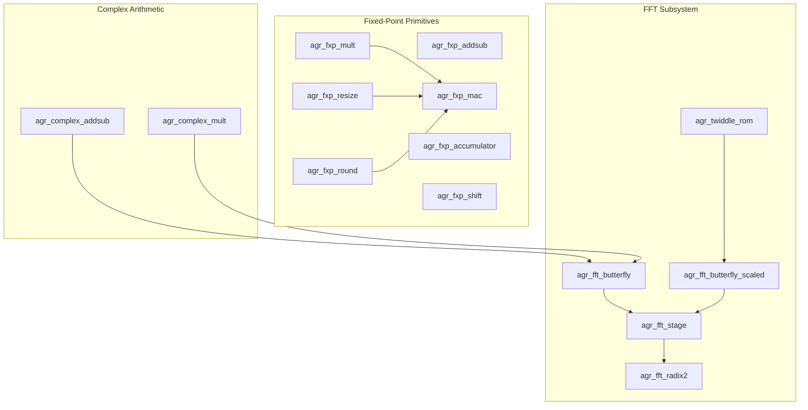

# AGR-FPGA-IP-Library

*Vendor-neutral, production-quality SystemVerilog IP cores for FPGA-based embedded and edge DSP systems.*
*Built by [Agrionics Co.](https://sincerelystepper.github.io/agrionicsco) — open for the community.*

[](LICENSE)
[](https://ieeexplore.ieee.org/document/8299595)
[](https://www.veripool.org/verilator/)
[](#core-catalogue)
[](#verification-scorecard)
[](#roadmap)

---

This library is a single, honest home for the reusable FPGA building blocks
Agrionics develops across its embedded-edge projects — SPI register bridges,
signed fixed-point arithmetic primitives, complex number cores, and a
complete radix-2 FFT pipeline. Every core is added when a real project
needs it, verified before it is called done, and documented with what it
*cannot* do yet, not just what it can.

---

## Table of Contents

- [What is actually in here](#what-is-actually-in-here)
- [Repository map](#repository-map)
- [Core catalogue](#core-catalogue)
  - [Communication](#communication)
  - [Fixed-point math](#fixed-point-math)
  - [Complex math](#complex-math)
  - [DSP — FFT subsystem](#dsp--fft-subsystem)
- [DSP pipeline architecture](#dsp-pipeline-architecture)
- [Verification scorecard](#verification-scorecard)
- [Design principles](#design-principles)
- [Quick start](#quick-start)
- [Roadmap](#roadmap)
- [Contributing](#contributing)
- [License](#license)

---

## What is actually in here

The repo layout under `rtl/` covers the full intended scope of the library
(`communication`, `control`, `dsp`, `infrastructure`, `math`, `memory`,
`sensors`), but many of those folders are currently `.gitkeep` scaffolding.
**Three areas have real, working, verified RTL today:**

| Area | Cores | Total checks |
|---|---|---|
| `rtl/communication/spi/` | 1 (SPI bridge) | directed regression + iCE40 synthesis |
| `rtl/math/fixed_point/` | 8 signed arithmetic primitives | 77,500+ |
| `rtl/math/complex/` | 2 complex arithmetic cores | 27,100+ |
| `rtl/dsp/fft/` | 5 FFT subsystem cores | 36,000+ |

Everything else below describes exactly that — what is real, what is
verified, and what is still a folder waiting for code.

---

## Repository map

```
AGR-FPGA-IP-Library/
│
├── rtl/
│   ├── communication/
│   │   └── spi/
│   │       └── agr_spi_bridge/          ✅ RTL + C++ TB + Yosys synthesis (iCE40, 146 cells)
│   │
│   ├── math/
│   │   ├── fixed_point/
│   │   │   ├── addsub/                  ✅ verified
│   │   │   ├── mult/                    ✅ verified
│   │   │   ├── resize/                  ✅ verified
│   │   │   ├── round/                   ✅ verified
│   │   │   ├── mac/                     ✅ verified
│   │   │   ├── acc/                     ✅ verified (stateful — first sequential core)
│   │   │   └── shift/                   ✅ verified
│   │   └── complex/
│   │       ├── complex_mult/            ✅ verified
│   │       └── complex_addsub/          ✅ verified
│   │
│   └── dsp/
│       └── fft/
│           ├── twiddle_rom/             ✅ verified (Q1.14 fixed-point, N-parameterised)
│           ├── fft_butterfly/           ✅ verified (unscaled radix-2)
│           ├── fft_butterfly_scaled/    ✅ verified (÷2 scaling, precision-loss tracking)
│           ├── fft_stage/               ✅ verified (N/2 butterflies in parallel)
│           └── agr_fft_radix2/          ✅ verified (complete N-point radix-2 DIT FFT)
│
├── docs/                                ⚙️  stubs — architecture, coding guidelines, etc.
├── scripts/                             ⚙️  ci · lint · simulation · synthesis (folders exist)
└── examples/                            ⚙️  planned
```

Legend: ✅ RTL + self-checking testbench verified   ⚙️ planned / in progress

---

## Core catalogue

### Communication

| Core | Path | Checks | What it does |
|---|---|---|---|
| `agr_spi_bridge` | [`rtl/communication/spi/agr_spi_bridge`](rtl/communication/spi/agr_spi_bridge) | directed + synthesis | SPI slave → internal register-bus bridge. CDC synchronisation on all SPI inputs. Yosys iCE40: **146 cells** (41 LUT4, 104 FF), **~50 MHz** est. Fmax. Full architecture/timing/verification docs + waveforms. |

---

### Fixed-point math

Eight signed two's-complement primitives forming a complete arithmetic
toolkit. All are pure combinational (`v1`). The stateful accumulator
(`agr_fxp_accumulator`) is the one exception — it wraps combinational
next-state logic in a clocked register with explicit `rst > clear > load >
enable > hold` priority.

Every core follows the same two-flag contract:
`overflow` = true magnitude/range error, `precision_loss` = information
discarded but result still ordered and in range.

| Core | Path | Checks | What it does |
|---|---|---|---|
| `agr_fxp_addsub` | [`rtl/math/fixed_point/addsub`](rtl/math/fixed_point/addsub) | 114 | Signed add/subtract with IN_W+1 guard bit, optional saturation |
| `agr_fxp_mult` | [`rtl/math/fixed_point/mult`](rtl/math/fixed_point/mult) | **20,038** | Signed multiplier: exact full-precision product + MSB/LSB-aligned truncation. DSP-inference safe. |
| `agr_fxp_resize` | [`rtl/math/fixed_point/resize`](rtl/math/fixed_point/resize) | **24,053** | Width adapter: truncate or saturate, MSB- or LSB-aligned. Fixed `precision_loss` definition vs. naive OR-of-bits. |
| `agr_fxp_round` | [`rtl/math/fixed_point/round`](rtl/math/fixed_point/round) | **15,061** | Width reduction via rounding: truncate / nearest / half-up / convergent (round-half-to-even, bias-free) |
| `agr_fxp_mac` | [`rtl/math/fixed_point/mac`](rtl/math/fixed_point/mac) | **27,060** | Multiply-accumulate: `acc + scaled(a×b)`. Single overflow check on exact sum (no premature intermediate clamp). |
| `agr_fxp_accumulator` | [`rtl/math/fixed_point/acc`](rtl/math/fixed_point/acc) | **187** (×3 assertions) | Stateful accumulator with `clk/rst/clear/load/enable`. Saturating and wrapping modes. First sequential core. |
| `agr_fxp_shift` | [`rtl/math/fixed_point/shift`](rtl/math/fixed_point/shift) | **6,106** | Arithmetic left/right shift for gain control, FFT normalisation, power-of-2 scaling. Overflow + precision_loss flags. |

---

### Complex math

| Core | Path | Checks | What it does |
|---|---|---|---|
| `agr_complex_mult` | [`rtl/math/complex/complex_mult`](rtl/math/complex/complex_mult) | **9,033** | 4-multiply complex multiplier `(a+jb)(c+jd)`. Full-precision intermediate, MSB-aligned resize, optional convergent rounding, per-component saturation. |
| `agr_complex_addsub` | [`rtl/math/complex/complex_addsub`](rtl/math/complex/complex_addsub) | **18,069** | Complex add/subtract. IN_W+1 guard bit, MSB-aligned resize to OUT_W, per-component overflow + saturation. Core FFT butterfly primitive. |

---

### DSP — FFT subsystem

Five cores composing a complete parameterised radix-2 DIT FFT pipeline,
from twiddle-factor ROM through to an N-point transform. All combinational
(`v1`); pipeline registers are a planned future variant.

| Core | Path | Checks | What it does |
|---|---|---|---|
| `agr_twiddle_rom` | [`rtl/dsp/fft/twiddle_rom`](rtl/dsp/fft/twiddle_rom) | directed | Precomputed Q1.14 twiddle factors `W[k] = cos(2πk/N) − j·sin(2πk/N)`. N-parameterised, synthesises to BRAM or LUT ROM. |
| `agr_fft_butterfly` | [`rtl/dsp/fft/fft_butterfly`](rtl/dsp/fft/fft_butterfly) | **8,000** | Unscaled radix-2 DIT butterfly: `X0 = A + B·W`, `X1 = A − B·W`. Full-precision intermediate, no precision loss. |
| `agr_fft_butterfly_scaled` | [`rtl/dsp/fft/fft_butterfly_scaled`](rtl/dsp/fft/fft_butterfly_scaled) | **8,012** | Scaled butterfly with arithmetic `÷2` per output (`>>> 1`). Bounds bit-growth to 1 bit regardless of stage depth. Tracks per-component precision_loss. |
| `agr_fft_stage` | [`rtl/dsp/fft/fft_stage`](rtl/dsp/fft/fft_stage) | **2,000+** | One complete FFT stage: N/2 scaled butterflies instantiated in parallel via `generate`. Correct stride-based data pairing. Overflow = OR of all butterfly overflows. |
| `agr_fft_radix2` | [`rtl/dsp/fft/agr_fft_radix2`](rtl/dsp/fft/agr_fft_radix2) | directed + impulse/DC/random | Complete N-point radix-2 DIT FFT. Composes `log2(N)` stages with precomputed twiddle factors. Verified on impulse (flat spectrum), DC (bin-0 concentration), and random inputs. |

---

## DSP pipeline architecture

The fixed-point and complex cores are designed to compose directly into
DSP datapaths. The full FFT signal chain from input to frequency-domain
output is:


```mermaid
flowchart TD
    subgraph Fixed-Point Primitives
        A[agr_fxp_addsub] 
        B[agr_fxp_mult]
        C[agr_fxp_resize]
        D[agr_fxp_round]
        E[agr_fxp_mac]
        F[agr_fxp_accumulator]
        G[agr_fxp_shift]
    end

    subgraph Complex Arithmetic
        H[agr_complex_addsub]
        I[agr_complex_mult]
    end

    subgraph FFT Subsystem
        J[agr_twiddle_rom] --> L
        K[agr_fft_butterfly] --> M
        L[agr_fft_butterfly_scaled] --> M
        M[agr_fft_stage] --> N
        N[agr_fft_radix2]
    end

    B --> E
    C --> E
    D --> E
    H --> K
    I --> K
```

**Butterfly dataflow (single stage):**

```
for i in 0 .. N/2-1:
    A  = in[i]
    B  = in[i + N/2]
    W  = twiddle_rom[i]

    X0 = (A + B·W) >> 1     ← agr_fft_butterfly_scaled
    X1 = (A − B·W) >> 1

    out[i]       = X0
    out[i + N/2] = X1
```

`log2(N)` stages of this pattern, with twiddle indices rotating per
stage, compose into the complete radix-2 DIT FFT in `agr_fft_radix2`.

---

## Verification scorecard

Every core ships with a self-checking SystemVerilog testbench and a
C++ Verilator driver. Checks are compared against an independently-computed
64-bit golden model — not waveform eyeballing.

| Core | Vectors | Random cases | Golden model | Status |
|---|---|---|---|---|
| `agr_spi_bridge` | directed R/W regression | — | C++ harness | ✅ PASS |
| `agr_fxp_addsub` | 114 | 100 | 64-bit SV | ✅ PASS |
| `agr_fxp_mult` | 20,038 | 5,000 × 4 DUTs | 64-bit SV | ✅ PASS |
| `agr_fxp_resize` | 24,053 | 3,000 × 8 DUTs | 64-bit SV | ✅ PASS |
| `agr_fxp_round` | 15,061 | 3,000+ | 64-bit SV | ✅ PASS |
| `agr_fxp_mac` | 27,060 | 3,000 × 9 DUTs | 64-bit SV | ✅ PASS |
| `agr_fxp_accumulator` | 187 (×3 assertions) | 5,000 cycles | 64-bit SV | ✅ PASS |
| `agr_fxp_shift` | 6,106 | 3,000 | 64-bit SV | ✅ PASS |
| `agr_complex_mult` | 9,033 | 3,000 | 64-bit SV | ✅ PASS |
| `agr_complex_addsub` | 18,069 | 3,000 × 2 ops | 64-bit SV | ✅ PASS |
| `agr_twiddle_rom` | directed (N=8, N=16) | — | SV assertions | ✅ PASS |
| `agr_fft_butterfly` | 8,000 | 2,000 | 64-bit SV | ✅ PASS |
| `agr_fft_butterfly_scaled` | 8,012 | 2,000 | 64-bit SV | ✅ PASS |
| `agr_fft_stage` | 2,000+ | 2,000 N=4 | 64-bit SV | ✅ PASS |
| `agr_fft_radix2` | impulse + DC + random | random | software FFT reference | ✅ PASS |
| **TOTAL** | **~140,000+** | | | |

Simulation environment: **Verilator 5.048** on **MSYS2 UCRT64** (Windows).
Build flow: `verilator --cc --exe --build` with C++17 driver.

---

## Design principles

Not aspirational rules — these are enforced in every core above and in every
new core before it is marked verified:

**1. One overflow check on the exact value, never on a truncated intermediate.**
All MAC, complex multiply, and FFT butterfly cores carry full precision
through every intermediate stage, check overflow *once* on the exact
mathematical result, then truncate or saturate. Premature intermediate
clamping was identified as a real RTL bug in early drafts and eliminated.

**2. `overflow` and `precision_loss` are never conflated.**
`overflow` = the result does not fit in the output range and is a true
magnitude/range error. `precision_loss` = lower-order bits were discarded
but the result is still correctly ordered and sign-preserving. Both flags
exist independently on every core that can exhibit each condition.

**3. No silent wraparound on a saturating path.**
When `USE_SATURATE=1`, hitting overflow always clamps to a real
`MAX`/`MIN` value chosen from the *exact, un-wrapped* result's sign.
The clamped output is never a sign-flipped wrapped bit pattern.

**4. Self-checking testbenches with a 64-bit golden model, not waveform eyeballing.**
Every testbench computes the expected result independently in 64-bit
testbench arithmetic, compares it on every vector at simulation time, and
prints a clear `PASS` / `FAIL` count. Directed tests cover numerical
boundaries and known edge cases; random regression covers everything else.

**5. No implicit casting, no width-mismatch warnings.**
RTL is written to lint clean under `verilator -Wall`. Every sign-extension,
truncation, and width change is explicit. The `int'()` cast is used where
Verilator 5.x on UCRT64 requires it for correct signed propagation.

**6. Limitations are documented, not hidden.**
Each core's own README (where it exists) follows the model established in
`agr_spi_bridge`: specific, independently-reproducible findings. Known
open issues are tracked in the [Roadmap](#roadmap) below, not buried.

---

## Quick start

### Fixed-point / complex / FFT cores (UCRT64 build flow)

Each core follows the same structure: `rtl/`, `tb/`, `sim/build.sh`.

```bash
cd rtl/math/fixed_point/resize/sim
./build.sh
./obj_dir/Vtb_agr_fxp_resize
```

```
=== agr_fxp_resize self-checking testbench ===
=== 24053 checks run, 0 errors ===
*** ALL TESTS PASSED ***
```

The `build.sh` in each `sim/` directory calls:

```bash
verilator -Wall --trace --timing \
    -Wno-WIDTHTRUNC -Wno-WIDTHEXPAND -Wno-UNUSEDSIGNAL \
    --top-module tb_<module> \
    --cc ../rtl/<module>.sv ../tb/tb_<module>.sv \
    --exe tb_<module>.cpp \
    --build -CFLAGS "-std=c++17 -O3"
```

### SPI bridge (Makefile flow)

```bash
cd rtl/communication/spi/agr_spi_bridge/tb
make sim      # directed write/read regression
make wave     # regenerate wave.vcd for GTKWave
```

### FFT subsystem

The full radix-2 FFT composes all five DSP cores automatically:

```bash
cd rtl/dsp/fft/agr_fft_radix2/sim
./build.sh
./obj_dir/Vtb_agr_fft_radix2
```

---

## Roadmap

### Immediate (open issues in existing cores)

- [ ] `agr_fxp_round` — close the known gap in rounding-overflow detection at the MSB-aligned upper boundary (verified as reachable; fix identified, not yet committed)
- [ ] `agr_fxp_addsub` — validate overflow flag for `OUT_W < IN_W` narrowing configurations
- [ ] `agr_fft_butterfly_scaled` — fix `trunc_ovf` check (currently compares post-shift value against pre-shift, yields always-zero in the safe-parameterisation regime; needs a clean range check instead)
- [ ] CI pipeline — `scripts/ci/` folder exists, scripts do not yet

### Near term

- [ ] Pipelined (`v2`) variants of `agr_fxp_mult`, `agr_fxp_mac`, `agr_fft_butterfly_scaled` (pipeline registers between existing stages — no architectural changes)
- [ ] `agr_fifo_sync` — synchronous FIFO (RTL draft exists locally, random-regression test timing needs fixing before commit)
- [ ] Fill `docs/` stubs (architecture, coding guidelines, supported devices, synthesis flow, verification strategy)
- [ ] Consolidate the two verification harness styles (pure-SV vs. SV + C++ driver) into one standard flow

### DSP

- [ ] FIR filter (direct-form, using `agr_fxp_mac` chain)
- [ ] CIC decimator / interpolator
- [ ] NCO (numerically controlled oscillator)
- [ ] CORDIC
- [ ] General biquad IIR filter

### Control

- [ ] PID controller
- [ ] PWM generator
- [ ] Quadrature encoder interface
- [ ] Sigma-delta modulator

### Communication

- [ ] UART (TX + RX)
- [ ] I2C controller
- [ ] CAN controller
- [ ] Full `agr_spi_bridge` parameterisation (multi-register map, configurable word width)

### Infrastructure

- [ ] CDC synchroniser primitives (2FF, pulse, handshake)
- [ ] Reset synchroniser
- [ ] Pipeline register helper (enable/stall-aware)
- [ ] Clock management wrappers

### Memory

- [ ] BRAM wrapper (single/dual-port)
- [ ] Sync/async FIFO (from `agr_fifo_sync` draft)
- [ ] ROM wrapper
- [ ] SRAM interface

### Math

- [ ] Integer divider (restoring / non-restoring)
- [ ] Square root (digit-recurrence)

---

## Contributing

See [`CONTRIBUTING.md`](CONTRIBUTING.md). Until that is fleshed out:
issues and PRs that come with a reproducible Verilator repro — a failing
case *and* a passing case showing the fix — are the fastest path to
landing. All new RTL is held to the [design principles](#design-principles)
above before merge.

---

## License

MIT — see [`LICENSE`](LICENSE).

---

<sub>AGR-FPGA-IP-Library is maintained by Agrionics Co. as part of its
FPGA-accelerated IoT/edge node work. Built on MSYS2 UCRT64 with Verilator 5.048.
Questions or integration requests — open an issue.</sub>
