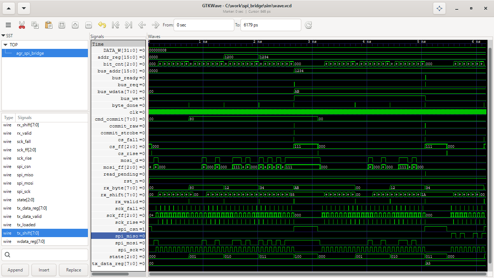
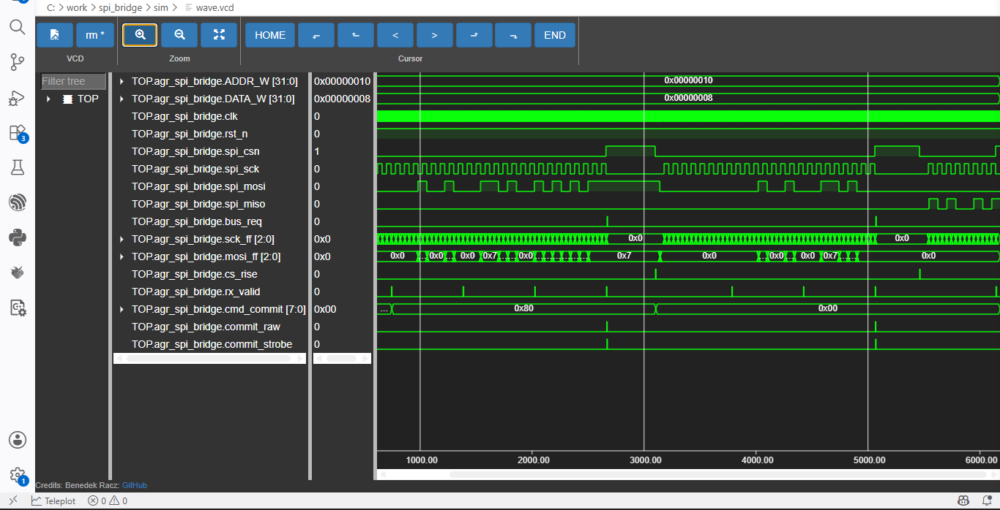

# AGR SPI Bridge


SPI-to-internal-register-bus slave bridge for FPGA designs. Translates a
4-byte SPI command frame into single-cycle read/write requests on a small
synchronous register bus, with CDC synchronization on every SPI input.

Part of the [AGR-FPGA-IP-Library](../../../../README.md).

---

## What is it?

A vendor-neutral SystemVerilog SPI **slave** that sits between an external
SPI master (an MCU, typically) and an internal register bus inside the
FPGA. It does the boring, error-prone part — clock-domain crossing,
bit-banging, byte framing, address/data latching — so that the peripheral
behind it only has to implement a 6-wire request/ready handshake.

## Why was it built?

Every FPGA project in this library that needs an MCU to configure or read
back internal registers (the AgriGuard edge node being the first) needs
this exact piece of glue logic. Building it once, verifying it properly,
and reusing it is cheaper than re-deriving SPI CDC timing for every new
design.

## How does it work?

1. Three independent 3-stage synchronizers bring `spi_csn`, `spi_sck`, and
   `spi_mosi` into the `clk` domain and generate edge pulses.
2. A bit engine shifts `spi_mosi` into an 8-bit register, one bit per
   detected SPI clock edge.
3. A small FSM walks each completed byte through `CMD → ADDR_H → ADDR_L →
   [WDATA]`, latching address and (for writes) data as they arrive.
4. A 2-stage pipeline turns the completed frame into a single-cycle
   `bus_req` pulse on the register bus.
5. For reads, the byte returned by the bus (`bus_rdata` / `bus_ready`) is
   staged and shifted back out over `spi_miso` during a **second** SPI
   transaction — see [Read protocol](#read-protocol-two-transactions) below,
   this is the part that bit us during bring-up and is worth reading.

Full signal-level walkthrough: [`docs/architecture.md`](docs/architecture.md).

## How do I simulate it?

```bash
cd tb
make sim     # fast pass/fail regression (tb.cpp, no waveform)
make wave    # regenerate waveforms/wave.vcd (tb_wave.cpp, traced)
make clean
```

Expected output:

```
=== WRITE ===
WRITE: PASS
=== READ ===
  READ_REQ: addr=0x1234
READ: 0xa5 (expected 0xA5) -> PASS
```

## How do I integrate it?

Instantiate `agr_spi_bridge`, wire the SPI pins to your physical pads, and
implement the bus side: decode `bus_addr` while `bus_req && bus_we` is high
to accept writes, and drive `bus_rdata` + a one-cycle `bus_ready` pulse in
response to `bus_req && !bus_we` to answer reads. See
[Register interface](docs/architecture.md#register-interface) for the exact
handshake and [Read protocol](#read-protocol-two-transactions) for the
two-transaction read requirement your SPI master needs to respect.

## How do I verify it?

The regression in `tb/tb.cpp` is self-checking — it drives a write and a
read and checks the observed bus/SPI activity against expected constants,
no manual waveform inspection required. See
[`docs/verification.md`](docs/verification.md) for what is and is not
covered, lint/synthesis results, and the bug this core just shipped with
(found and fixed the same day this package was assembled — left in the
record on purpose).

---

## Interface

### Parameters

| Parameter | Type | Default | Notes |
|---|---|---|---|
| `ADDR_W` | `int` | `16` | Width of `bus_addr`. **Not yet fully threaded through the frame logic — verified only at the default. See [Limitations](#known-limitations).** |
| `DATA_W` | `int` | `8`  | Width of `bus_wdata`/`bus_rdata`. **Same caveat as `ADDR_W`.** |

### Ports

| Signal | Dir | Width | Description |
|---|---|---|---|
| `clk` | in | 1 | System clock. Every SPI input is asynchronous to it and passes through a CDC synchronizer. |
| `rst_n` | in | 1 | Asynchronous active-low reset. |
| `spi_csn` | in | 1 | SPI chip-select, active low. |
| `spi_sck` | in | 1 | SPI clock, driven by the external master. |
| `spi_mosi` | in | 1 | SPI data in. |
| `spi_miso` | out | 1 | SPI data out. |
| `bus_req` | out | 1 | One-cycle pulse: a register access is being requested. |
| `bus_we` | out | 1 | `1` = write, `0` = read. Valid while `bus_req` is high. |
| `bus_addr` | out | `ADDR_W` | Target register address. Valid while `bus_req` is high. |
| `bus_wdata` | out | `DATA_W` | Write data. Valid while `bus_req && bus_we`. |
| `bus_rdata` | in | `DATA_W` | Read data, sampled on the cycle `bus_ready` is asserted. |
| `bus_ready` | in | 1 | Pulse from the peripheral: `bus_rdata` is valid (reads), or the write has landed (writes — not currently required, see below). |

The bus side has no fixed-latency requirement — `bus_ready` can arrive any
number of cycles after `bus_req`; the bridge just waits. There is, however,
no timeout, so a peripheral that never asserts `bus_ready` will leave a read
pending indefinitely (cleared only by the next `spi_csn` release).

### SPI frame format

| Byte | Write frame | Read frame (transaction A) |
|---|---|---|
| 1 | `CMD` = `0x80 \| reserved[6:0]` | `CMD` = `0x00 \| reserved[6:0]` |
| 2 | `ADDR[15:8]` | `ADDR[15:8]` |
| 3 | `ADDR[7:0]` | `ADDR[7:0]` |
| 4 | `WDATA[7:0]` | — (returned in transaction B instead) |

Only bit 7 of `CMD` is decoded (write/read select); bits `[6:0]` are
captured but otherwise unused — reserved for future opcodes.

### Read protocol: two transactions

This is the one thing every integrator needs to know before touching this
core, because it's exactly what broke during bring-up:

> A read is **not** a single SPI transaction. Transaction A (`CSN` low for
> 3 bytes: `CMD=0x00`, `ADDR_H`, `ADDR_L`) sets the address and triggers the
> internal `bus_req`. The bridge then needs `CSN` to **go high and come back
> low again** — a fresh transaction B — before it will shift the fetched
> byte out over `spi_miso`. The shift register only loads on a new
> chip-select assertion.

There is no busy/ack signal: if transaction B starts before the bus side
has actually returned `bus_ready`, `spi_miso` will simply hold its last
value rather than flag an error. The gap between A and B must be sized by
the integrator to cover the peripheral's response latency — see
[`docs/timing.md`](docs/timing.md).

---

## Simulation results



WRITE (`0x1234 <= 0xAB`) and READ (`0x1234 => 0xA5`) both pass against the
fixed RTL. Zoomed view of the corrected read-response phase, bit-by-bit:



Both images and `waveforms/wave.vcd` were regenerated from the current RTL
on the date this package was assembled — see `tb/tb_wave.cpp` and
`make wave` if you change the RTL and need to refresh them. (The previous
images in this folder were captured *before* a same-day fix and show
`MISO` stuck low for the entire read response — replace them with these
two; details in `docs/verification.md`.)

---

## Known limitations

These are real findings from a lint/synthesis/parameter-override pass done
while writing this document, not hedging — each is independently
verifiable with the commands noted.

1. **`ADDR_W`/`DATA_W` are not fully parameterized.** `addr_reg` and
   `wdata_reg` are hardcoded `[15:0]`/`[7:0]` internally, and the frame FSM
   always expects exactly 2 address bytes + 1 data byte regardless of the
   parameter values. Overriding either parameter produces real
   `WIDTHTRUNC`/`WIDTHEXPAND` warnings from Verilator on the
   `bus_addr`/`bus_wdata`/`bus_rdata` assignments. **Verified configuration:
   `ADDR_W=16`, `DATA_W=8` only.**
2. **SPI Mode 0 / Mode 3 are claimed but not independently verified.** The
   testbench master holds `MOSI` stable across the *entire* bit period
   rather than exercising strict half-period CPHA setup/hold timing, and
   `CPOL=1` (idle-high `SCK`) has never been driven. Functionally the
   bit-engine likely tolerates both, but it hasn't been tested against a
   protocol-strict master.
3. **Reads need two SPI transactions**, with no flow control between them
   (see above). The required minimum gap is bus-peripheral-dependent and is
   the integrator's responsibility, not something this IP enforces.
4. **`read_buffer` is dead logic** — written, never read anywhere
   (confirmed via Verilator `UNUSEDSIGNAL` and grep). Harmless; synthesis
   optimizes it away. Should be deleted in a cleanup pass.
5. **Two `case(state)` blocks are intentionally non-exhaustive**
   (`-Wno-CASEINCOMPLETE` in `build.sh`). Unreachable 3-bit state encodings
   have no explicit transition, though `cs_rise` unconditionally forces
   `state <= S_IDLE` on the next chip-select assertion regardless, so the
   FSM self-recovers within one transaction. An explicit `default:` branch
   is still recommended hardening.
6. **Back-to-back frames within one continuous `CSN` assertion** are
   structurally supported (a 5th byte clocked in right after a completed
   write frame is treated as a new `CMD` byte) but not exercised by any
   existing test.

Full detail, lint output, and the synthesis numbers behind these:
[`docs/verification.md`](docs/verification.md).

## Future work

- Thread `ADDR_W`/`DATA_W` properly through the frame FSM (variable address/data byte counts).
- Add the `default: state <= S_IDLE;` hardening branch.
- Remove `read_buffer`.
- Add explicit ack/busy signaling for the read-response phase instead of relying on integrator-side timing margin.
- Verify against a protocol-strict SPI Mode 0 and Mode 3 master (half-period setup/hold) and a `CPOL=1` master.
- Add a regression for back-to-back multi-frame transactions in one `CSN` assertion.
- Rename the internal `sck_rise`/`sck_fall` edge-detect wires so their names match the physical edge they actually detect (they're currently swapped, the same class of bug fixed in `cs_fall`/`cs_rise` this release — harmless today only because every consumer is self-consistent with the swap).

## License

MIT — see [`LICENSE`](LICENSE) (mirrors the library root license).
